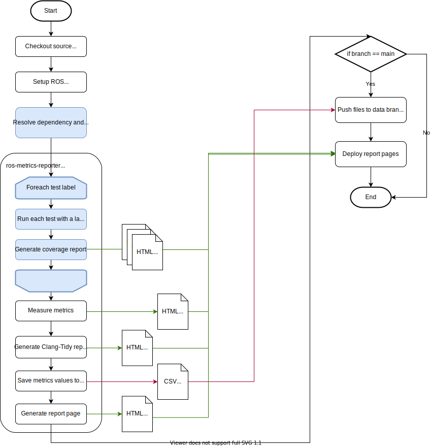

This is the design document for the [`ros-metrics-reporter`](../../ros-metrics-reporter) package.

# Purpose / Use cases

This package is intended to measure software quality for any ROS2 package. The metrics are collected by [`ros-metrics-reporter`](../../ros-metrics-reporter) and the results are generated as HTML reports.
Currently, the following metrics are collected:

* LCOV coverage report
  * Includes Line, Function and Branch coverage.
  * You can specify test labels to filter the coverage report.
* Lizard metrics report
* Clang-Tidy report

Since these tools are not dedicated to ROS2, if you want results for each package, you need to process the results.
The `ros-metrics-reporter` automates this tedious procedure and outputs the information that the user really wants to know.

# Design

This package is available on GitHub Actions. Even if the developer is not familiar with measuring software quality, you can use the right tools to measure software quality. It also supports dashboard functions and data logging that cannot be obtained when using each tool alone.

## File structure

### action.yml

#### inputs section

The inputs section is used to specify the input files and variables.

#### outputs section

The outputs section is used to specify the output directory. It is useful when you want to deploy the results to a remote server on GitHub Actions.

#### runs section

The runs section describes the steps to generate metrics reports.

### Python scripts

* The entrypoint file is `ros_metrics_reporter/ros_metrics_reporter.py`.
* Tests are in `tests/`.

### Flowchart



## Assumptions / Known limitations

If you have a lot of code in your repository, you may get stuck in GitHub Actions resource limits.
You can check the resource limit here:
<https://docs.github.com/en/actions/using-github-hosted-runners/about-github-hosted-runners#supported-runners-and-hardware-resources>

## Inputs / Outputs / API

### Input

#### Arguments

You can get the input from the following sources:
<https://github.com/tier4/ros-metrics-reporter#available-options>

#### Configuration files

##### LCOV

**.lcovrc**
You can copy this file to your repository and edit the file to change the default options. Available options are: <https://linux.die.net/man/5/lcovrc>
You need to locate the file in the root directory of your repository if you edit the file.

##### CodeChecker

**codechecker-config.json**
You can copy this file to your repository and edit the file to change the default options. Available options are: <https://codechecker.readthedocs.io/en/latest/analyzer/user_guide/#analyzer-configuration-file>
You need to specify the file with the `codechecker-config-path` argument.

**codechecker-skip-list.txt**
You can copy this file to your repository and edit the file to change the exclude settings. File format is described here: <https://codechecker.readthedocs.io/en/latest/analyzer/user_guide/#skip>

##### Hugo

By overriding the Hugo configuration files and themes in this repository, you can use the design and settings of your choice.
The configuration files and references are as follows:

**example/hugo-site/config.toml**
 <https://gohugo.io/getting-started/configuration/#configuration-file>

**example/hugo-site/themes/**
The various themes can be downloaded from the following link: <https://themes.gohugo.io/>

### Output

You will get an HTML page like this.
<https://tier4.github.io/ros-metrics-reporter/>

# Usage

## Basic usage of `ros-metrics-reporter`

### Create new branch (First time only)

Before running this job, you need to create orphan branch.
This tool automatically pushes artifacts to the data branch of your repository every time. The old data will be used to generate a time series graph on the HTML artifact.
To generate new branch, you need to run the following command.
NOTE: Replace `your-project` with your project name before running commands below.

```sh
git clone https://github/your-project.git
cd your-project
mkdir data
cd data
git init
git remote add origin https://github/your-project.git
touch .gitignore
git add .
git commit -m 'initial commit'
git push origin master:data
```

### Write your GitHub Actions

In order to create a correct HTML report, please follow the steps below.

### Step1: Clone target repository

Clones your repository, using the `ref` option to specify the branch to be cloned. The default branch is the one configured in your repository settings.

```yaml
    - name: Clone default branch
      uses: actions/checkout@v2
```

Also, clone the data branch created in the above procedure.

```yaml
    - name: Clone data branch in this repo
      uses: actions/checkout@v2
      with:
        ref: data
        path: ${{ env.ARTIFACTS_DIR }}
```

### Step2: Setup ROS environment

Setup ROS environment, using the `required-ros-distributions` option to specify the ROS distribution to use.

```yaml
    - uses: ros-tooling/setup-ros@v0.2
      with:
        required-ros-distributions: galactic
```

### Step3: Build

Copy the following code to the `runs` section of your workflow. The build option is important for generating the test coverage report.

```yaml
    - name: Build
      run: |
        . /opt/ros/galactic/setup.sh
        colcon build --event-handlers console_cohesion+ \
          --cmake-args -DCMAKE_CXX_FLAGS="-fprofile-arcs -ftest-coverage -DCOVERAGE_RUN=1" -DCMAKE_C_FLAGS="-fprofile-arcs -ftest-coverage -DCOVERAGE_RUN=1" -DCMAKE_EXPORT_COMPILE_COMMANDS=ON
```

### Step4: Generate coverage report

Copy the following code to the `runs` section of your workflow. Add or modify input arguments as needed.

```yaml
    - id: metrics-reporter
      uses: tier4/ros-metrics-reporter@v0.3
      with:
        artifacts-dir: ${{ env.ARTIFACTS_DIR }}
        base-url: ${{ env.BASE_URL }}
        title: ${{ env.TITLE }}
        ros-distro: ${{ env.ROS_DISTRO }}
```

### Step5: Push artifacts

Push the metrics data to the data branch to be used for the next time series graph creation.

```yaml
    - name: Push artifacts
      if: github.ref == 'refs/heads/main'
      uses: peaceiris/actions-gh-pages@v3
      with:
        github_token: ${{ secrets.GITHUB_TOKEN }}
        publish_dir: ${{ env.ARTIFACTS_DIR }}
        publish_branch: data
```

If you want to deploy the HTML artifacts to a GitHub Pages, you need to add the following code to the `runs` section of your workflow.

```yaml
    - name: Deploy public to gh-pages (main branch only)
      if: github.ref == 'refs/heads/main'
      uses: peaceiris/actions-gh-pages@v3
      with:
        github_token: ${{ secrets.GITHUB_TOKEN }}
        publish_dir: public
```

### Generated branches

**data**: The data branch is used to generate the time series graph.

**gh-pages**: The gh-pages branch is used to deploy the HTML artifacts to a GitHub pages.

# Development

## Setup development environment

You can use venv to setup development environment.

```sh
cd ros-metrics-reporter
python3 -m venv venv
source venv/bin/activate
```

After the environment is set up, you can install the dependencies with Poetry.

```sh
pip3 install poetry
poetry install
```

If you want to run the tests, you can use the following command.

```sh
poetry run tox
```

# References / External links

* LCOV: <http://ltp.sourceforge.net/coverage/lcov.php>
* Lizard: <https://github.com/terryyin/lizard>
* Clang-Tidy: <https://clang.llvm.org/extra/clang-tidy/>

# Future extensions / Unimplemented parts

* Addition of dynamic analysis tools
